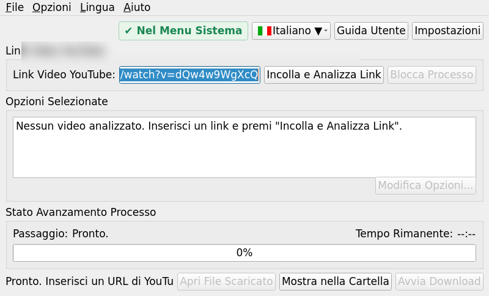
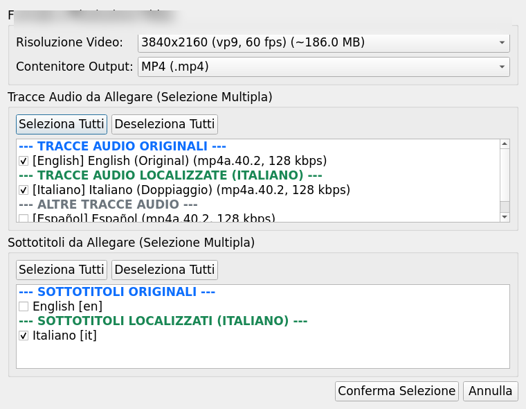
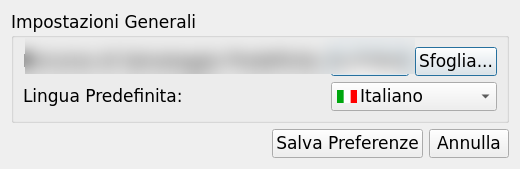
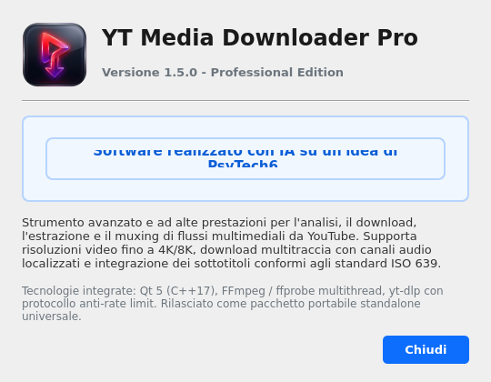
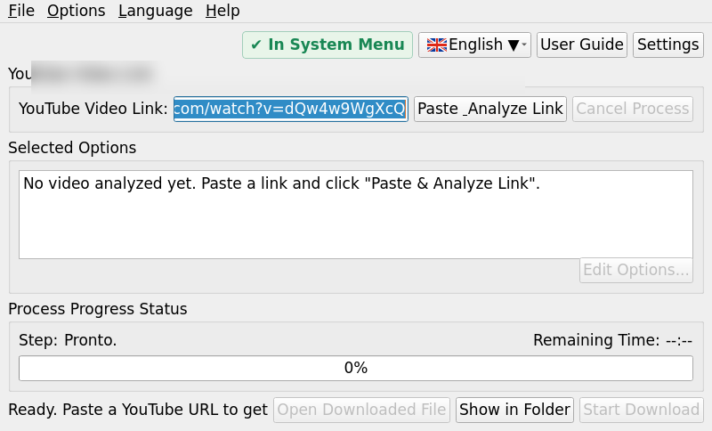
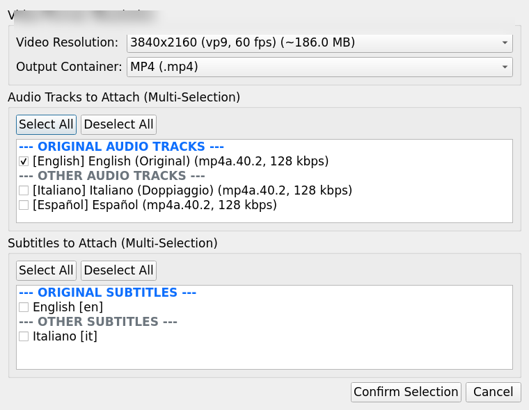
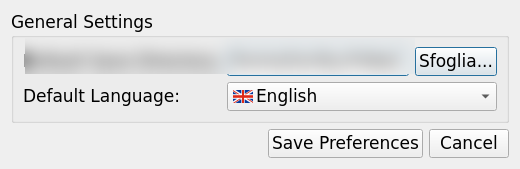
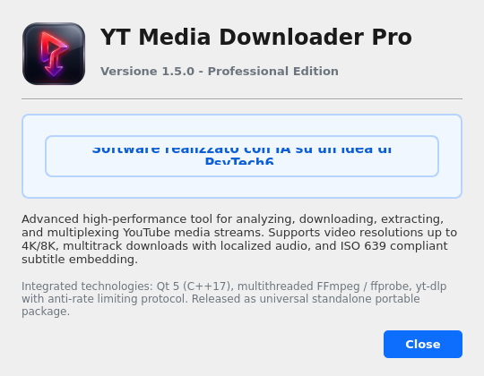

# YTMediaDownloader Pro

[](https://en.wikipedia.org/wiki/C%2B%2B17)
[](https://www.qt.io/)
[](https://www.linux.org/)
[](LICENSE)
[](#crediti)

> **Progetto:** YTMediaDownloader Pro  
> **Concept & Ideazione:** PsyTech6  
> **Sviluppo:** Realizzato con Intelligenza Artificiale (IA)

---

## 🇮🇹 Italiano

### Panoramica
**YTMediaDownloader Pro** è un'applicazione desktop moderna basata su **C++17** e **Qt 5** progettata per l'analisi approfondita, la selezione granulare dei flussi multimediali e il download multiplexato ad alta fedeltà di video, tracce audio multilingua e sottotitoli da YouTube.

Il software è stato concepito da **PsyTech6** ed interamente implementato tramite **Intelligenza Artificiale**, con un'architettura modulare, reattiva e completamente disaccoppiata dall'interfaccia utente.

---

### Caratteristiche Principali

- 🎬 **Analisi e Risoluzioni Complete**: Rilevamento automatico di tutte le risoluzioni video disponibili (da 144p fino a 4K e 8K a 60fps) e contenitori supportati (`MP4`, `MKV`, `WebM`).
- 🎧 **Gestione Audio Multitraccia Avanzata**: Estrazione e preservazione delle tracce audio originali e localizzate, con tagging ISO 639-2 per una perfetta compatibilità su lettori multimediali (VLC, Smart TV, dispositivi mobili).
- 💬 **Sottotitoli Multipli**: Supporto al download simultaneo di sottotitoli manuali e generati automaticamente in formato VTT/SRT.
- ⚡ **Architettura Asincrona con Worker Thread**: Tutte le operazioni di download e codifica FFmpeg vengono elaborate in un thread separato (`QThread`), garantendo una GUI fluida e reattiva al 100%.
- 🛑 **Cancellazione Sicura e Pulizia File**: Interruzione immediata ad albero di tutti i sottoprocessi (`ffmpeg`, `yt-dlp`) e rimozione automatica dei file temporanei parziali.
- 🖥️ **Integrazione Desktop di Sistema (XDG)**: Pulsante per abilitare o disabilitare con un clic il lanciatore dell'applicazione (`.desktop`) e l'icona di sistema nei menu e nella ricerca del desktop Linux (GNOME, KDE Plasma, XFCE).
- 📂 **Pulsante "Mostra nella Cartella" Intelligente**: Pulsante sempre attivo con funzionamento a doppia modalità:
  1. Se nessun file è stato ancora scaricato, apre la cartella di destinazione mostrandone il contenuto.
  2. Se è presente un file scaricato, apre il gestore file di sistema evidenziando e selezionando direttamente il file multimediale.
- 🌐 **Interfaccia Multilingua con Bandiere Nazionali**: Traduzione completa in 5 lingue (Italiano, English, Français, Deutsch, Español) con icone grafiche delle bandiere in tutti i menu di scelta.
- 📖 **Guida Utente HTML Integrata**: Documentazione tecnica e operativa richiamabile direttamente dall'applicazione (`F1`) o visualizzabile nel browser, sincronizzata con la lingua attiva.
- 🎯 **Usabilità e Focus Immediato**: All'avvio dell'applicazione il cursore è automaticamente posizionato nel campo del link YouTube, consentendo l'incolla rapido immediato (`Ctrl+V`).

---

### Schermate dell'Applicazione (Italiano)

> *Nota sulla privacy: I dati sensibili (come percorsi utente, indirizzi e collegamenti specifici) sono stati opportunamente sfocati a tutela della riservatezza.*

#### 1. Finestra Principale
Interfaccia pulita e moderna con barra dei menu, pulsante di integrazione di sistema, scorciatoie da tastiera e monitoraggio del download.



#### 2. Analisi e Selezione Tracce Media
Selezione avanzata di risoluzioni video, contenitore finale, tracce audio multilingue e sottotitoli.



#### 3. Preferenze e Impostazioni
Configurazione della cartella di download predefinita e selezione immediata della lingua con bandiera nazionale.



#### 4. Informazioni sul Software (About Dialog)
Crediti formali, versione del software e attribuzione dell'ideazione a PsyTech6.



---

### Scorciatoie da Tastiera

| Scorciatoia | Azione |
| :--- | :--- |
| `Ctrl + V` | Incolla e Avvia Analisi Link |
| `Ctrl + D` | Avvia Download |
| `Esc` | Blocca Processo in Corso |
| `Ctrl + O` | Apri File Multimediale Scaricato |
| `Ctrl + F` | Mostra nella Cartella (apre cartella o seleziona file) |
| `Ctrl + E` | Modifica Opzioni Video/Audio |
| `Ctrl + ,` | Apri Finestra Impostazioni |
| `F1` | Visualizza Guida Utente HTML |
| `Ctrl + I` | Informazioni sul Software (About) |
| `Ctrl + Q` | Esci dall'Applicazione |

---

### Compilazione da Sorgente

#### Requisiti di Sistema
- Compilatore C++17 (`g++` o `clang++`)
- Qt 5 (moduli: `Widgets`, `Core`, `Gui`, `Xml`)
- `ffmpeg` e `ffprobe`
- `yt-dlp`

#### Procedura di Build
```bash
# Clona il repository
git clone https://github.com/PsyTech1976/YTMediaDownloader.git
cd YTMediaDownloader/YTMediaDownloader_Qt

# Genera il Makefile con qmake
qmake YTMediaDownloader.pro

# Compila
make -j$(nproc)

# Esegui l'applicazione
./YTMediaDownloader
```

---

### Distribuzione Standalone AppImage

Il progetto include uno script di packaging automatico (`package_appimage.sh`) che genera un pacchetto `.AppImage` auto-consistente contenente:
- Il binario `YTMediaDownloader`
- I binari esecutivi `ffmpeg`, `ffprobe` e `yt-dlp`
- Tutte le librerie audio/video condivise di FFmpeg
- Guide utente in 5 lingue e risorse grafiche

```bash
# Esegui lo script dalla directory principale
./package_appimage.sh
```

---

<br>
<hr>
<br>

## 🇬🇧 English

### Overview
**YTMediaDownloader Pro** is an advanced desktop application built with **C++17** and **Qt 5** designed for deep stream analysis, granular media track selection, and high-fidelity multiplexed downloading of YouTube videos, multilingual audio tracks, and subtitles.

The software was conceived by **PsyTech6** and entirely developed using **Artificial Intelligence (AI)**, following a responsive, modular, and thread-isolated architecture.

---

### Key Features

- 🎬 **Comprehensive Stream Discovery**: Automatic detection of all available resolutions (from 144p up to 4K and 8K at 60fps) and container formats (`MP4`, `MKV`, `WebM`).
- 🎧 **Advanced Multitrack Audio**: Download and preserve both original and localized dub tracks, fully labeled with ISO 639-2 metadata for maximum media player compatibility.
- 💬 **Multiple Subtitles**: Simultaneous download of manual and automatic captions in VTT and SRT formats.
- ⚡ **Asynchronous Worker Thread**: FFmpeg and yt-dlp operations run on an isolated worker thread (`QThread`), keeping the user interface smooth and responsive.
- 🛑 **Safe Process Cancellation**: Immediate process-tree termination (`SIGKILL`/`pkill`) and automatic temporary file cleanup when an operation is cancelled.
- 🖥️ **OS Desktop Integration (XDG)**: Integrated toggle button to register or remove the application launcher (`.desktop`) and desktop icon in your Linux system application menu and search.
- 📂 **Smart "Show in Folder" Feature**: Dual-behavior button always available:
  1. Opens the destination directory when no download has taken place.
  2. Highlights and selects the downloaded file in your desktop file manager when completed.
- 🌐 **Multilingual Interface with Country Flags**: Complete localization into 5 languages (Italian, English, French, German, Spanish) with country flag icons across all selection menus.
- 📖 **Embedded HTML User Guide**: Multi-language documentation accessible directly inside the app (`F1`) or in your web browser.
- 🎯 **Instant URL Input Focus**: The typing cursor is automatically positioned inside the YouTube link input field on launch for immediate pasting (`Ctrl+V`).

---

### Application Screenshots (English)

> *Privacy notice: Sensitive information such as user paths, network addresses, and processed media titles have been blurred to ensure privacy.*

#### 1. Main Window
Modern interface featuring top menu bar, system desktop integration button, keyboard shortcuts, and download progress monitoring.



#### 2. Media Track Analyzer & Selection Dialog
Granular selection of video resolutions, target containers, multilingual audio channels, and subtitles.



#### 3. Preferences & Settings
Default download folder configuration and fast language selector with national flag indicator.



#### 4. About Software Dialog
Version details, build information, and credits acknowledging creation with AI based on an idea by PsyTech6.



---

### Keyboard Shortcuts

| Shortcut | Action |
| :--- | :--- |
| `Ctrl + V` | Paste & Analyze Link |
| `Ctrl + D` | Start Download |
| `Esc` | Stop Active Process |
| `Ctrl + O` | Open Downloaded File |
| `Ctrl + F` | Show in Folder (open folder or select file) |
| `Ctrl + E` | Edit Video/Audio Options |
| `Ctrl + ,` | Open Settings Dialog |
| `F1` | Open User Guide |
| `Ctrl + I` | About Software |
| `Ctrl + Q` | Quit Application |

---

### Building from Source

#### Prerequisites
- C++17 compatible compiler (`g++` or `clang++`)
- Qt 5 development packages (`Widgets`, `Core`, `Gui`, `Xml`)
- `ffmpeg` and `ffprobe`
- `yt-dlp`

#### Build Instructions
```bash
# Clone the repository
git clone https://github.com/PsyTech1976/YTMediaDownloader.git
cd YTMediaDownloader/YTMediaDownloader_Qt

# Generate Makefile with qmake
qmake YTMediaDownloader.pro

# Compile
make -j$(nproc)

# Launch
./YTMediaDownloader
```

---

### Standalone AppImage Packaging

Run the bundled packaging script to produce a fully self-contained `.AppImage` bundle with embedded `ffmpeg`, `ffprobe`, `yt-dlp`, and shared audio/video codec libraries:
```bash
./package_appimage.sh
```

---

## 📜 Crediti / Credits

- **Concept & Ideazione / Idea & Conception**: [PsyTech6](https://github.com/PsyTech1976)
- **Sviluppo / Development**: Realizzato con Intelligenza Artificiale (AI) / Developed with Artificial Intelligence (AI)
- **Licenza / License**: [MIT License](LICENSE)
